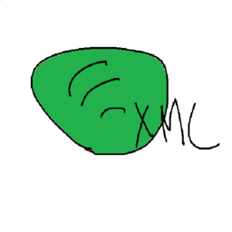
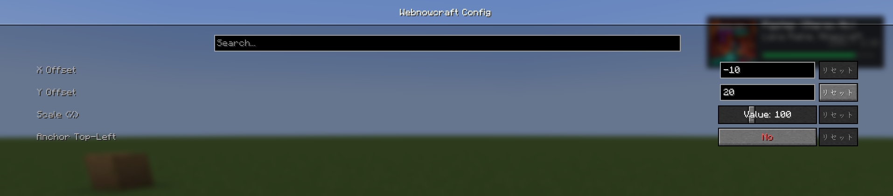

# 🎵 Webnowcraft

**Webnowcraft** は、Minecraftのプレイ画面上に **Spotifyの再生情報（Now Playing）** をリアルタイムで表示するクライアントサイドModです。
SpicetifyのWebNowPlaying拡張機能と連携し、アルバムアート、曲名、アーティスト名、プログレスバーをスタイリッシュに描画します。

<!-- 
  【画像挿入箇所 1: Modアイコン】
  内容: あなたの描いた「素晴らしい」アイコン画像 (icon.png)
  配置場所: リポジトリの assets/webnowcraft/icon.png など
-->

  

## ✨ 特徴 (Features)

*   **リアルタイム同期**: Spotifyの再生・一時停止、曲送りに即座に反応します。
*   **アルバムアート表示**: 高画質なカバー画像をHUDに表示します。
*   **プログレスバー**: 曲の進行状況をバーで可視化します。
*   **カスタマイズ可能**: 表示位置（座標）、サイズ（スケール）、基準点（左上/右上）を自由に設定できます。

## 📸 スクリーンショット (Screenshots)

### インゲーム HUD (In-Game HUD)
<!-- 
  【画像挿入箇所 2: ゲームプレイ画面】
  内容: Minecraftをプレイ中に、画面端にSpotifyのHUDが表示されている様子のスクリーンショット。
  ポイント: 背景が明るすぎない場所（夜や洞窟、またはブロックの壁の前）で撮影するとHUDが見やすいです。
-->

### 設定画面 (Configuration)
<!-- 
  【画像挿入箇所 3: 設定画面】
  内容: Mod Menu から開いた Webnowcraft の設定画面（Cloth Config画面）。
  ポイント: X Offset, Y Offset, Scale などのスライダーが見えている状態のスクショ。
-->

## 🛠️ 前提条件 (Prerequisites)

このModを使用するには、以下の環境が必要です。

1.  **Minecraft 1.21.4 (Fabric)**
2.  **[Fabric API](https://modrinth.com/mod/fabric-api)**
3.  **[Cloth Config API](https://modrinth.com/mod/cloth-config)** (設定画面用)
4.  **[Mod Menu](https://modrinth.com/mod/modmenu)** (推奨: 設定画面へのアクセス用)
5.  **Spotify Desktop App** + **Spicetify CLI**

## 🚀 インストール方法 (Installation)

### 1. Spicetifyのセットアップ (必須)
このModは、Spotifyから情報を取得するために **Spicetify** とその拡張機能 **WebNowPlaying** が必要です。

1.  [Spicetify CLI](https://spicetify.app/docs/getting-started) をインストールします。
2.  以下のコマンドを実行して、WebNowPlaying拡張機能を導入・有効化します。

spicetify config extensions webnowplaying.js
spicetify apply

2. Modの導入

    Releases から最新の .jar ファイルをダウンロードします。

    Minecraftの mods フォルダにファイルを入れます。

    ゲームを起動します。

⚙️ 設定 (Configuration)

ゲーム内で Mod Menu のMod一覧から Webnowcraft を探し、設定ボタン（⚙️）を押すと以下の項目を変更できます。

    X Offset / Y Offset: 画面端からの表示位置を調整します。

    Scale: HUDの大きさを 50% ~ 200% の間で変更します。

    Anchor Top-Left: ONにすると左上基準、OFFにすると右上基準で配置します。

🤝 クレジット (Credits)

    Author: pa81

    Special Thanks:

        Spicetify & WebNowPlaying-Redux for the backend logic.

        Fabric Community for the modding toolchain.

📄 ライセンス (License)

This project is licensed under the MIT License - see the LICENSE file for details.
